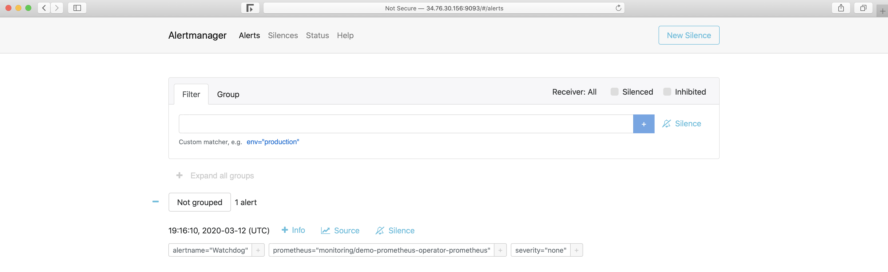
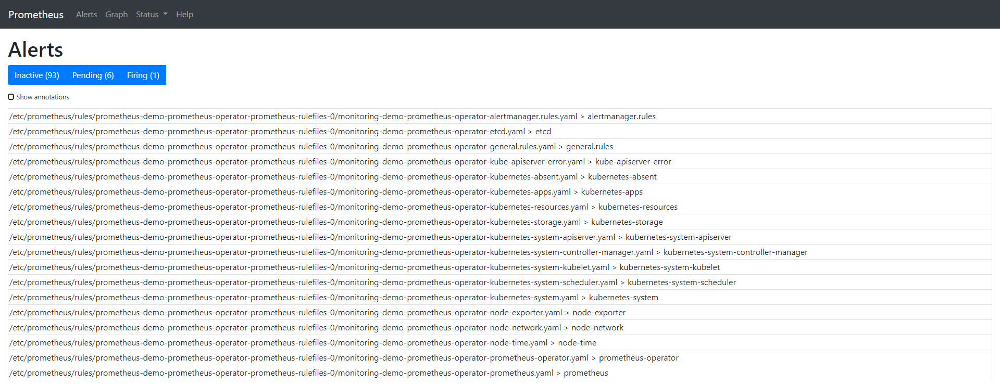
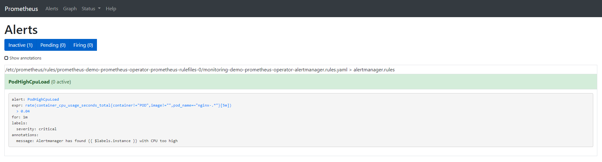
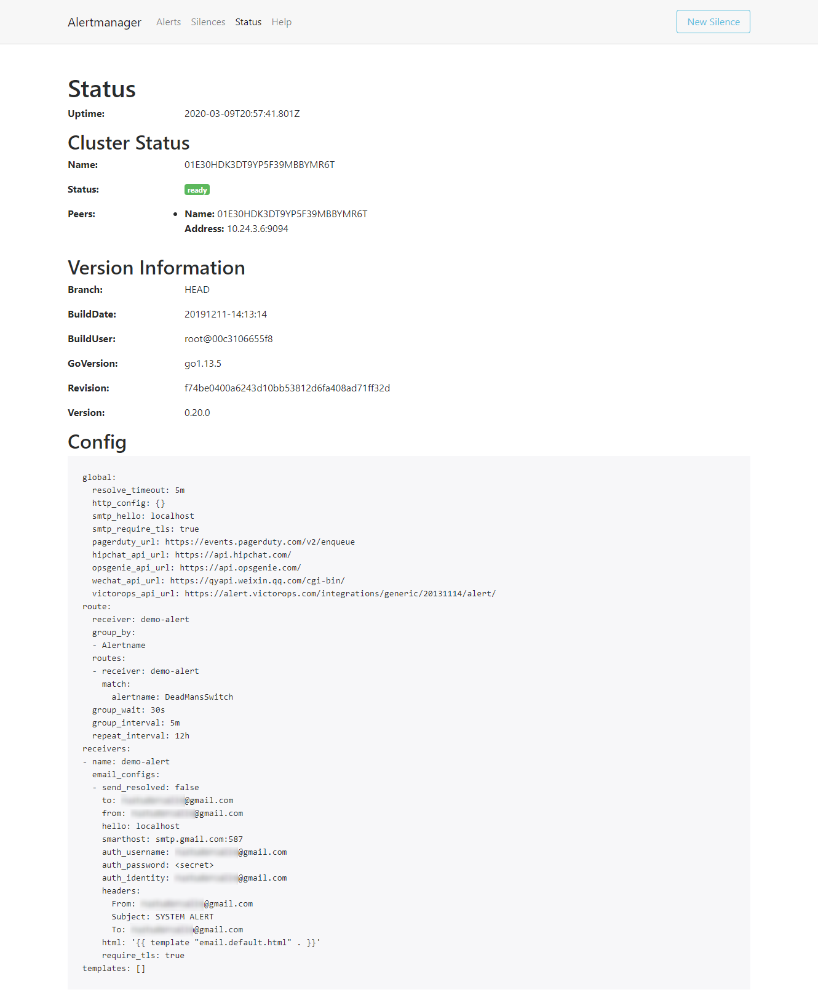
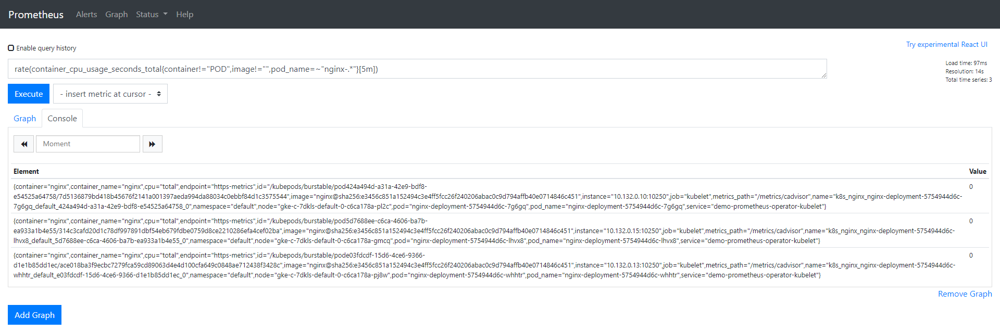
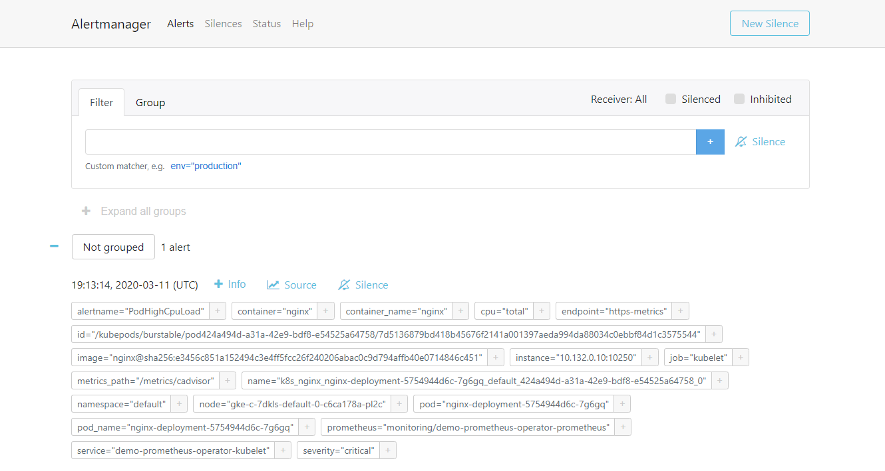

# Custom alerts using Prometheus queries

## Introduction

[**Prometheus**](https://prometheus.io) is an open-source system for monitoring and alerting originally developed by Soundcloud. It moved to CNCF in 2016 becoming one of the most popular projects after Kubernetes. It it used to monitor from an entire Linux server, to a stand-alone webserver, a database service or a single process. In Prometheus terminology the things it monitors are called **Targets**. Each unit of a target is called **a metric**. It pulls (scrapes) targets over http, at a set interval, to collect metrics and places the data in its **time-series database**. Metrics about targets can be queried using [PromQL](https://prometheus.io/docs/prometheus/latest/querying/basics/) query language.

In this article we will show a step-by-step setup guide on how to:
- install Prometheus (using [prometheus-operator](https://github.com/helm/charts/tree/master/stable/prometheus-operator) helm chart) in order to monitor/alert based on custom events.
- write and configure custom alerting rules, which will fire alerts when conditions are met.
- integrate Alertmanager in order to  handle these alerts sent by client applications (Prometheus server in this case).
- integrate Alertmanager with a mail account where notifications will be sent to.

## Understanding Prometheus and its abstractions

Let's see below all the components that form the Prometheus ecosystem (photo credit: [http://prometheus.io](https://prometheus.io/docs/introduction/overview/))


From all these, worths mentionining once more few terms we already used or are relevant to our exercise:
- Prometheus Server: main component that scrapes and stores metrics in a time series database.
    - Scrape: pulling method to retrieve metrics; it happens at a 'scrape_interval' usually of 10-60sec.
    - Target: server client where data gets retrieved from.
- Service discovery: it enables Prometheus to identify the applications it needs to monitor and pull metrics from within a dynamic environment
- Alert Manager: component responsible for handling alerts (silencing, inhibition, aggregation and sending out notifications via methods such as email, PagerDuty, Slack, etc)
- Data visualization: scraped data is stored in local storage and can be queried directly using PromQL or view it via Grafana dashboards.   

## Understanding Prometheus Operator

In few words, as described by CoreOS - owners of the project, Prometheus Operator makes the Prometheus configuration Kubernetes native and manages and operates Prometheus and Alertmanager clusters.

The Operator introduces the following Kubernetes custom resource definitions ([CRDs](https://kubernetes.io/docs/concepts/extend-kubernetes/api-extension/custom-resources/)): Prometheus, ServiceMonitor, PrometheusRule, Alertmanager. More details about these can be found [here](https://github.com/coreos/prometheus-operator/blob/master/Documentation/design.md). In our demo we will be using `PrometheusRule` to define some custome rules.

To install, we will use the [stable/prometheus-operator](https://github.com/helm/charts/tree/master/stable/prometheus-operator) helm chart.

The default installation deploys the followings components: prometheus-operator, prometheus, alertmanager, node-exporter, kube-state-metrics and grafana. By default, Prometheus will scrape the main Kubernetes components: kube-apiserver, kube-scheduler, kube-controller-manager, etcd.

## Installing Prometheus software

**Prerequisites**

To perform this demo you will need the following:
- a Google Cloud Platform account, the free tier provided is more than enough (any other cloud should work the same)
- [Rancher](https://rancher.com) v2.3.5 (latest while writing the article)
- Kubernetes cluster running on Google Kubernetes Engine version 1.15.9-gke.12 (running EKS or AKS should be the same)
- helm binary [installed](https://helm.sh/docs/intro/install/) on a working machine and tiller running inside Kubernetes cluster

**Starting a Rancher instance**

There is a very intuitive getting started guide for this purpose [here](https://rancher.com/quick-start/).

**Using Rancher to deploy a GKE cluster**

Use Rancher to set up and configure your Kubernetes cluster, follow the how-to [guide](https://rancher.com/docs/rancher/v2.x/en/cluster-provisioning/hosted-kubernetes-clusters/gke/).

As soon as this operation is ready and you have configured the kubeconfig file with appropriate credentials and endpoint information you can make use of `kubectl` to point at that specific cluster.

**Deploying Prometheus software**

<details><summary>Configuring helm and tiller</summary>

Let's check helm's version. From the output we can see beside the version that the server side component (tiller) is not installed.

```bash
$ helm version
Client: &version.Version{SemVer:"v2.15.2", GitCommit:"8dce272473e5f2a7bf58ce79bb5c3691db54c96b", GitTreeState:"clean"}
Error: could not find tiller
```

Let's install `tiller` and run again the version command to see how the output changes now.

```
$ helm init --wait
$HELM_HOME has been configured at /home/rustudorcalin/.helm.

Tiller (the Helm server-side component) has been installed into your Kubernetes Cluster.

Please note: by default, Tiller is deployed with an insecure 'allow unauthenticated users' policy.
To prevent this, run `helm init` with the --tiller-tls-verify flag.
For more information on securing your installation see: https://docs.helm.sh/using_helm/#securing-your-helm-installation
```

```bash
$ helm version
Client: &version.Version{SemVer:"v2.15.2", GitCommit:"8dce272473e5f2a7bf58ce79bb5c3691db54c96b", GitTreeState:"clean"}
Server: &version.Version{SemVer:"v2.15.2", GitCommit:"8dce272473e5f2a7bf58ce79bb5c3691db54c96b", GitTreeState:"clean"}
```

We need to create a service account for `tiller` and to take care of RBAC permissions. 

```bash
$ kubectl --namespace kube-system create serviceaccount tiller
serviceaccount/tiller created

$ kubectl create clusterrolebinding tiller-cluster-rule --clusterrole=cluster-admin --serviceaccount=kube-system:tiller
clusterrolebinding.rbac.authorization.k8s.io/tiller-cluster-rule created

$ kubectl --namespace kube-system patch deploy tiller-deploy -p '{"spec":{"template":{"spec":{"serviceAccount":"tiller"}}}}'
deployment.extensions/tiller-deploy patched
```
</details></br>

Having helm and tiller configured we can now proceed with the installation of `prometheus-operator`.

```bash
$ helm install --namespace monitoring --name demo stable/prometheus-operator
```

<details><summary>Click for full command output</summary>

```bash  
NAME:   demo
LAST DEPLOYED: Mon Mar  9 20:56:20 2020
NAMESPACE: monitoring
STATUS: DEPLOYED

RESOURCES:
==> v1/Alertmanager
NAME                                   AGE
demo-prometheus-operator-alertmanager  35s

==> v1/ClusterRole
NAME                                     AGE
demo-grafana-clusterrole                 35s
demo-prometheus-operator-operator        35s
demo-prometheus-operator-operator-psp    35s
demo-prometheus-operator-prometheus      35s
demo-prometheus-operator-prometheus-psp  35s
psp-demo-kube-state-metrics              35s
psp-demo-prometheus-node-exporter        35s

==> v1/ClusterRoleBinding
NAME                                     AGE
demo-grafana-clusterrolebinding          35s
demo-prometheus-operator-operator        35s
demo-prometheus-operator-operator-psp    35s
demo-prometheus-operator-prometheus      35s
demo-prometheus-operator-prometheus-psp  35s
psp-demo-kube-state-metrics              35s
psp-demo-prometheus-node-exporter        35s

==> v1/ConfigMap
NAME                                                        DATA  AGE
demo-grafana                                                1     35s
demo-grafana-config-dashboards                              1     35s
demo-grafana-test                                           1     35s
demo-prometheus-operator-apiserver                          1     35s
demo-prometheus-operator-cluster-total                      1     35s
demo-prometheus-operator-controller-manager                 1     35s
demo-prometheus-operator-etcd                               1     35s
demo-prometheus-operator-grafana-datasource                 1     35s
demo-prometheus-operator-k8s-resources-cluster              1     35s
demo-prometheus-operator-k8s-resources-namespace            1     35s
demo-prometheus-operator-k8s-resources-node                 1     35s
demo-prometheus-operator-k8s-resources-pod                  1     35s
demo-prometheus-operator-k8s-resources-workload             1     35s
demo-prometheus-operator-k8s-resources-workloads-namespace  1     35s
demo-prometheus-operator-kubelet                            1     35s
demo-prometheus-operator-namespace-by-pod                   1     35s
demo-prometheus-operator-namespace-by-workload              1     35s
demo-prometheus-operator-node-cluster-rsrc-use              1     35s
demo-prometheus-operator-node-rsrc-use                      1     35s
demo-prometheus-operator-nodes                              1     35s
demo-prometheus-operator-persistentvolumesusage             1     35s
demo-prometheus-operator-pod-total                          1     35s
demo-prometheus-operator-pods                               1     35s
demo-prometheus-operator-prometheus                         1     35s
demo-prometheus-operator-proxy                              1     35s
demo-prometheus-operator-scheduler                          1     35s
demo-prometheus-operator-statefulset                        1     35s
demo-prometheus-operator-workload-total                     1     35s

==> v1/DaemonSet
NAME                           DESIRED  CURRENT  READY  UP-TO-DATE  AVAILABLE  NODE SELECTOR  AGE
demo-prometheus-node-exporter  3        3        3      3           3          <none>         35s

==> v1/Deployment
NAME                               READY  UP-TO-DATE  AVAILABLE  AGE
demo-grafana                       1/1    1           1          35s
demo-kube-state-metrics            1/1    1           1          35s
demo-prometheus-operator-operator  1/1    1           1          35s

==> v1/Pod(related)
NAME                                                READY  STATUS   RESTARTS  AGE
demo-grafana-d767d786-kjvtw                         3/3    Running  0         35s
demo-kube-state-metrics-67bf64b7f4-9z96l            1/1    Running  0         35s
demo-prometheus-node-exporter-fnq56                 1/1    Running  0         35s
demo-prometheus-node-exporter-hpmfq                 1/1    Running  0         35s
demo-prometheus-node-exporter-sq2bh                 1/1    Running  0         35s
demo-prometheus-operator-operator-7d5776c444-pt844  2/2    Running  0         35s

==> v1/Prometheus
NAME                                 AGE
demo-prometheus-operator-prometheus  35s

==> v1/PrometheusRule
NAME                                                           AGE
demo-prometheus-operator-alertmanager.rules                    35s
demo-prometheus-operator-etcd                                  34s
demo-prometheus-operator-general.rules                         34s
demo-prometheus-operator-k8s.rules                             34s
demo-prometheus-operator-kube-apiserver-error                  34s
demo-prometheus-operator-kube-apiserver.rules                  34s
demo-prometheus-operator-kube-prometheus-node-recording.rules  34s
demo-prometheus-operator-kube-scheduler.rules                  34s
demo-prometheus-operator-kubernetes-absent                     35s
demo-prometheus-operator-kubernetes-apps                       34s
demo-prometheus-operator-kubernetes-resources                  34s
demo-prometheus-operator-kubernetes-storage                    35s
demo-prometheus-operator-kubernetes-system                     34s
demo-prometheus-operator-kubernetes-system-apiserver           35s
demo-prometheus-operator-kubernetes-system-controller-manager  34s
demo-prometheus-operator-kubernetes-system-kubelet             34s
demo-prometheus-operator-kubernetes-system-scheduler           34s
demo-prometheus-operator-node-exporter                         34s
demo-prometheus-operator-node-exporter.rules                   34s
demo-prometheus-operator-node-network                          34s
demo-prometheus-operator-node-time                             34s
demo-prometheus-operator-node.rules                            34s
demo-prometheus-operator-prometheus                            35s
demo-prometheus-operator-prometheus-operator                   34s

==> v1/Role
NAME                                   AGE
demo-grafana-test                      35s
demo-prometheus-operator-alertmanager  35s

==> v1/RoleBinding
NAME                                   AGE
demo-grafana-test                      35s
demo-prometheus-operator-alertmanager  35s

==> v1/Secret
NAME                                                TYPE    DATA  AGE
alertmanager-demo-prometheus-operator-alertmanager  Opaque  1     35s
demo-grafana                                        Opaque  3     35s

==> v1/Service
NAME                                              TYPE       CLUSTER-IP     EXTERNAL-IP  PORT(S)           AGE
demo-grafana                                      ClusterIP  10.27.244.232  <none>       80/TCP            35s
demo-kube-state-metrics                           ClusterIP  10.27.247.38   <none>       8080/TCP          35s
demo-prometheus-node-exporter                     ClusterIP  10.27.247.205  <none>       9100/TCP          35s
demo-prometheus-operator-alertmanager             ClusterIP  10.27.240.11   <none>       9093/TCP          35s
demo-prometheus-operator-coredns                  ClusterIP  None           <none>       9153/TCP          35s
demo-prometheus-operator-kube-controller-manager  ClusterIP  None           <none>       10252/TCP         35s
demo-prometheus-operator-kube-etcd                ClusterIP  None           <none>       2379/TCP          35s
demo-prometheus-operator-kube-proxy               ClusterIP  None           <none>       10249/TCP         35s
demo-prometheus-operator-kube-scheduler           ClusterIP  None           <none>       10251/TCP         35s
demo-prometheus-operator-operator                 ClusterIP  10.27.248.153  <none>       8080/TCP,443/TCP  35s
demo-prometheus-operator-prometheus               ClusterIP  10.27.246.9    <none>       9090/TCP          35s

==> v1/ServiceAccount
NAME                                   SECRETS  AGE
demo-grafana                           1        35s
demo-grafana-test                      1        35s
demo-kube-state-metrics                1        35s
demo-prometheus-node-exporter          1        35s
demo-prometheus-operator-alertmanager  1        35s
demo-prometheus-operator-operator      1        35s
demo-prometheus-operator-prometheus    1        35s

==> v1/ServiceMonitor
NAME                                              AGE
demo-prometheus-operator-alertmanager             34s
demo-prometheus-operator-apiserver                34s
demo-prometheus-operator-coredns                  34s
demo-prometheus-operator-grafana                  34s
demo-prometheus-operator-kube-controller-manager  34s
demo-prometheus-operator-kube-etcd                34s
demo-prometheus-operator-kube-proxy               34s
demo-prometheus-operator-kube-scheduler           34s
demo-prometheus-operator-kube-state-metrics       34s
demo-prometheus-operator-kubelet                  34s
demo-prometheus-operator-node-exporter            34s
demo-prometheus-operator-operator                 34s
demo-prometheus-operator-prometheus               34s

==> v1beta1/ClusterRole
NAME                     AGE
demo-kube-state-metrics  35s

==> v1beta1/ClusterRoleBinding
NAME                     AGE
demo-kube-state-metrics  35s

==> v1beta1/MutatingWebhookConfiguration
NAME                                AGE
demo-prometheus-operator-admission  35s

==> v1beta1/PodSecurityPolicy
NAME                                   PRIV   CAPS      SELINUX           RUNASUSER  FSGROUP    SUPGROUP  READONLYROOTFS  VOLUMES
demo-grafana                           false  RunAsAny  RunAsAny          RunAsAny   RunAsAny   false     configMap,emptyDir,projected,secret,downwardAPI,persistentVolumeClaim
demo-grafana-test                      false  RunAsAny  RunAsAny          RunAsAny   RunAsAny   false     configMap,downwardAPI,emptyDir,projected,secret
demo-kube-state-metrics                false  RunAsAny  MustRunAsNonRoot  MustRunAs  MustRunAs  false     secret
demo-prometheus-node-exporter          false  RunAsAny  RunAsAny          MustRunAs  MustRunAs  false     configMap,emptyDir,projected,secret,downwardAPI,persistentVolumeClaim,hostPath
demo-prometheus-operator-alertmanager  false  RunAsAny  RunAsAny          MustRunAs  MustRunAs  false     configMap,emptyDir,projected,secret,downwardAPI,persistentVolumeClaim
demo-prometheus-operator-operator      false  RunAsAny  RunAsAny          MustRunAs  MustRunAs  false     configMap,emptyDir,projected,secret,downwardAPI,persistentVolumeClaim
demo-prometheus-operator-prometheus    false  RunAsAny  RunAsAny          MustRunAs  MustRunAs  false     configMap,emptyDir,projected,secret,downwardAPI,persistentVolumeClaim

==> v1beta1/Role
NAME          AGE
demo-grafana  35s

==> v1beta1/RoleBinding
NAME          AGE
demo-grafana  35s

==> v1beta1/ValidatingWebhookConfiguration
NAME                                AGE
demo-prometheus-operator-admission  34s


NOTES:
The Prometheus Operator has been installed. Check its status by running:
  kubectl --namespace monitoring get pods -l "release=demo"

Visit https://github.com/coreos/prometheus-operator for instructions on how
to create & configure Alertmanager and Prometheus instances using the Operator.
```
</details></br>

## Prometheus alerting rules

Besides monitoring, Prometheus allows us to have rules which should trigger alerts. These rules are based on Prometheus expression language expressions. Whenever a condition is met, the alert is fired and it's sent to Alertmanager. We will see later on how a rule looks like.

Let's get back to our demo. As soon as helm has finished the deployment we can check what pods have been created:

```bash
$ kubectl -n monitoring get pods
NAME                                                   READY   STATUS    RESTARTS   AGE
alertmanager-demo-prometheus-operator-alertmanager-0   2/2     Running   0          61s
demo-grafana-5576fbf669-9l57b                          3/3     Running   0          72s
demo-kube-state-metrics-67bf64b7f4-4786k               1/1     Running   0          72s
demo-prometheus-node-exporter-ll8zx                    1/1     Running   0          72s
demo-prometheus-node-exporter-nqnr6                    1/1     Running   0          72s
demo-prometheus-node-exporter-sdndf                    1/1     Running   0          72s
demo-prometheus-operator-operator-b9c9b5457-db9dj      2/2     Running   0          72s
prometheus-demo-prometheus-operator-prometheus-0       3/3     Running   1          50s
```

In order to access Prometheus and AlertManager from a web browser we need to use port forwarding.

As this demo uses a GCP instance, and all kubectl commands are run from this instance, we will be using the instance's external IP address in order to access the resources.

```bash
$ kubectl port-forward --address 0.0.0.0 -n monitoring prometheus-demo-prometheus-operator-prometheus-0 9090  >/dev/null 2>&1 &
```


```bash
$ kubectl port-forward --address 0.0.0.0 -n monitoring alertmanager-demo-prometheus-operator-alertmanager-0 9093  >/dev/null 2>&1 &
```



The Alerts tab from Prometheus UI shows us all the currently running/configured alerts. This can be checked from CLI as well by querying the CRD called `prometheusrules`: 



```bash
$ kubectl -n monitoring get prometheusrules
NAME                                                            AGE
demo-prometheus-operator-alertmanager.rules                     3m21s
demo-prometheus-operator-etcd                                   3m21s
demo-prometheus-operator-general.rules                          3m21s
demo-prometheus-operator-k8s.rules                              3m21s
demo-prometheus-operator-kube-apiserver-error                   3m21s
demo-prometheus-operator-kube-apiserver.rules                   3m21s
demo-prometheus-operator-kube-prometheus-node-recording.rules   3m21s
demo-prometheus-operator-kube-scheduler.rules                   3m21s
demo-prometheus-operator-kubernetes-absent                      3m21s
demo-prometheus-operator-kubernetes-apps                        3m21s
demo-prometheus-operator-kubernetes-resources                   3m21s
demo-prometheus-operator-kubernetes-storage                     3m21s
demo-prometheus-operator-kubernetes-system                      3m21s
demo-prometheus-operator-kubernetes-system-apiserver            3m21s
demo-prometheus-operator-kubernetes-system-controller-manager   3m21s
demo-prometheus-operator-kubernetes-system-kubelet              3m21s
demo-prometheus-operator-kubernetes-system-scheduler            3m21s
demo-prometheus-operator-node-exporter                          3m21s
demo-prometheus-operator-node-exporter.rules                    3m21s
demo-prometheus-operator-node-network                           3m21s
demo-prometheus-operator-node-time                              3m21s
demo-prometheus-operator-node.rules                             3m21s
demo-prometheus-operator-prometheus                             3m21s
demo-prometheus-operator-prometheus-operator                    3m21s
```

We can check the physical files as well, located in prometheus-operator Pod, in prometheus container.

```bash
$ kubectl -n monitoring exec -it prometheus-demo-prometheus-operator-prometheus-0 -- /bin/sh
Defaulting container name to prometheus.
Use 'kubectl describe pod/prometheus-demo-prometheus-operator-prometheus-0 -n monitoring' to see all of the containers in this pod.
```

Inside the container, we can check the path where rules are stored:

```bash
/prometheus $ ls /etc/prometheus/rules/prometheus-demo-prometheus-operator-prometheus-rulefiles-0/
monitoring-demo-prometheus-operator-alertmanager.rules.yaml                    monitoring-demo-prometheus-operator-kubernetes-system-apiserver.yaml
monitoring-demo-prometheus-operator-etcd.yaml                                  monitoring-demo-prometheus-operator-kubernetes-system-controller-manager.yaml
monitoring-demo-prometheus-operator-general.rules.yaml                         monitoring-demo-prometheus-operator-kubernetes-system-kubelet.yaml
monitoring-demo-prometheus-operator-k8s.rules.yaml                             monitoring-demo-prometheus-operator-kubernetes-system-scheduler.yaml
monitoring-demo-prometheus-operator-kube-apiserver-error.yaml                  monitoring-demo-prometheus-operator-kubernetes-system.yaml
monitoring-demo-prometheus-operator-kube-apiserver.rules.yaml                  monitoring-demo-prometheus-operator-node-exporter.rules.yaml
monitoring-demo-prometheus-operator-kube-prometheus-node-recording.rules.yaml  monitoring-demo-prometheus-operator-node-exporter.yaml
monitoring-demo-prometheus-operator-kube-scheduler.rules.yaml                  monitoring-demo-prometheus-operator-node-network.yaml
monitoring-demo-prometheus-operator-kubernetes-absent.yaml                     monitoring-demo-prometheus-operator-node-time.yaml
monitoring-demo-prometheus-operator-kubernetes-apps.yaml                       monitoring-demo-prometheus-operator-node.rules.yaml
monitoring-demo-prometheus-operator-kubernetes-resources.yaml                  monitoring-demo-prometheus-operator-prometheus-operator.yaml
monitoring-demo-prometheus-operator-kubernetes-storage.yaml                    monitoring-demo-prometheus-operator-prometheus.yaml
```

To understand more on how these rules are loaded into Prometheus we should check the Pods' details. We can see for prometheus container the config file which is used `etc/prometheus/config_out/prometheus.env.yaml`. Checking further this config will show us the location of the files or the frequency set for yaml files to be rechecked.

```bash
$ kubectl -n monitoring describe pod prometheus-demo-prometheus-operator-prometheus-0
```

<details><summary>Click for full command output</summary>

```bash
Name:           prometheus-demo-prometheus-operator-prometheus-0
Namespace:      monitoring
Priority:       0
Node:           gke-c-7dkls-default-0-c6ca178a-gmcq/10.132.0.15
Start Time:     Wed, 11 Mar 2020 18:06:47 +0000
Labels:         app=prometheus
                controller-revision-hash=prometheus-demo-prometheus-operator-prometheus-5ccbbd8578
                prometheus=demo-prometheus-operator-prometheus
                statefulset.kubernetes.io/pod-name=prometheus-demo-prometheus-operator-prometheus-0
Annotations:    <none>
Status:         Running
IP:             10.40.0.7
IPs:            <none>
Controlled By:  StatefulSet/prometheus-demo-prometheus-operator-prometheus
Containers:
  prometheus:
    Container ID:  docker://360db8a9f1cce8d72edd81fcdf8c03fe75992e6c2c59198b89807aa0ce03454c
    Image:         quay.io/prometheus/prometheus:v2.15.2
    Image ID:      docker-pullable://quay.io/prometheus/prometheus@sha256:914525123cf76a15a6aaeac069fcb445ce8fb125113d1bc5b15854bc1e8b6353
    Port:          9090/TCP
    Host Port:     0/TCP
    Args:
      --web.console.templates=/etc/prometheus/consoles
      --web.console.libraries=/etc/prometheus/console_libraries
      --config.file=/etc/prometheus/config_out/prometheus.env.yaml
      --storage.tsdb.path=/prometheus
      --storage.tsdb.retention.time=10d
      --web.enable-lifecycle
      --storage.tsdb.no-lockfile
      --web.external-url=http://demo-prometheus-operator-prometheus.monitoring:9090
      --web.route-prefix=/
    State:       Running
      Started:   Wed, 11 Mar 2020 18:07:07 +0000
    Last State:  Terminated
      Reason:    Error
      Message:    caller=main.go:648 msg="Starting TSDB ..."
level=info ts=2020-03-11T18:07:02.185Z caller=web.go:506 component=web msg="Start listening for connections" address=0.0.0.0:9090
level=info ts=2020-03-11T18:07:02.192Z caller=head.go:584 component=tsdb msg="replaying WAL, this may take awhile"
level=info ts=2020-03-11T18:07:02.192Z caller=head.go:632 component=tsdb msg="WAL segment loaded" segment=0 maxSegment=0
level=info ts=2020-03-11T18:07:02.194Z caller=main.go:663 fs_type=EXT4_SUPER_MAGIC
level=info ts=2020-03-11T18:07:02.194Z caller=main.go:664 msg="TSDB started"
level=info ts=2020-03-11T18:07:02.194Z caller=main.go:734 msg="Loading configuration file" filename=/etc/prometheus/config_out/prometheus.env.yaml
level=info ts=2020-03-11T18:07:02.194Z caller=main.go:517 msg="Stopping scrape discovery manager..."
level=info ts=2020-03-11T18:07:02.194Z caller=main.go:531 msg="Stopping notify discovery manager..."
level=info ts=2020-03-11T18:07:02.194Z caller=main.go:553 msg="Stopping scrape manager..."
level=info ts=2020-03-11T18:07:02.194Z caller=manager.go:814 component="rule manager" msg="Stopping rule manager..."
level=info ts=2020-03-11T18:07:02.194Z caller=manager.go:820 component="rule manager" msg="Rule manager stopped"
level=info ts=2020-03-11T18:07:02.194Z caller=main.go:513 msg="Scrape discovery manager stopped"
level=info ts=2020-03-11T18:07:02.194Z caller=main.go:527 msg="Notify discovery manager stopped"
level=info ts=2020-03-11T18:07:02.194Z caller=main.go:547 msg="Scrape manager stopped"
level=info ts=2020-03-11T18:07:02.197Z caller=notifier.go:598 component=notifier msg="Stopping notification manager..."
level=info ts=2020-03-11T18:07:02.197Z caller=main.go:718 msg="Notifier manager stopped"
level=error ts=2020-03-11T18:07:02.197Z caller=main.go:727 err="error loading config from \"/etc/prometheus/config_out/prometheus.env.yaml\": couldn't load configuration (--config.file=\"/etc/prometheus/config_out/prometheus.env.yaml\"): open /etc/prometheus/config_out/prometheus.env.yaml: no such file or directory"

      Exit Code:    1
      Started:      Wed, 11 Mar 2020 18:07:02 +0000
      Finished:     Wed, 11 Mar 2020 18:07:02 +0000
    Ready:          True
    Restart Count:  1
    Liveness:       http-get http://:web/-/healthy delay=0s timeout=3s period=5s #success=1 #failure=6
    Readiness:      http-get http://:web/-/ready delay=0s timeout=3s period=5s #success=1 #failure=120
    Environment:    <none>
    Mounts:
      /etc/prometheus/certs from tls-assets (ro)
      /etc/prometheus/config_out from config-out (ro)
      /etc/prometheus/rules/prometheus-demo-prometheus-operator-prometheus-rulefiles-0 from prometheus-demo-prometheus-operator-prometheus-rulefiles-0 (rw)
      /prometheus from prometheus-demo-prometheus-operator-prometheus-db (rw)
      /var/run/secrets/kubernetes.io/serviceaccount from demo-prometheus-operator-prometheus-token-jvbrr (ro)
  prometheus-config-reloader:
    Container ID:  docker://de27cdad7067ebd5154c61b918401b2544299c161850daf3e317311d2d17af3d
    Image:         quay.io/coreos/prometheus-config-reloader:v0.37.0
    Image ID:      docker-pullable://quay.io/coreos/prometheus-config-reloader@sha256:5e870e7a99d55a5ccf086063efd3263445a63732bc4c04b05cf8b664f4d0246e
    Port:          <none>
    Host Port:     <none>
    Command:
      /bin/prometheus-config-reloader
    Args:
      --log-format=logfmt
      --reload-url=http://127.0.0.1:9090/-/reload
      --config-file=/etc/prometheus/config/prometheus.yaml.gz
      --config-envsubst-file=/etc/prometheus/config_out/prometheus.env.yaml
    State:          Running
      Started:      Wed, 11 Mar 2020 18:07:04 +0000
    Ready:          True
    Restart Count:  0
    Limits:
      cpu:     100m
      memory:  25Mi
    Requests:
      cpu:     100m
      memory:  25Mi
    Environment:
      POD_NAME:  prometheus-demo-prometheus-operator-prometheus-0 (v1:metadata.name)
    Mounts:
      /etc/prometheus/config from config (rw)
      /etc/prometheus/config_out from config-out (rw)
      /var/run/secrets/kubernetes.io/serviceaccount from demo-prometheus-operator-prometheus-token-jvbrr (ro)
  rules-configmap-reloader:
    Container ID:  docker://5804e45380ed1b5374a4c2c9ee4c9c4e365bee93b9ccd8b5a21f50886ea81a91
    Image:         quay.io/coreos/configmap-reload:v0.0.1
    Image ID:      docker-pullable://quay.io/coreos/configmap-reload@sha256:e2fd60ff0ae4500a75b80ebaa30e0e7deba9ad107833e8ca53f0047c42c5a057
    Port:          <none>
    Host Port:     <none>
    Args:
      --webhook-url=http://127.0.0.1:9090/-/reload
      --volume-dir=/etc/prometheus/rules/prometheus-demo-prometheus-operator-prometheus-rulefiles-0
    State:          Running
      Started:      Wed, 11 Mar 2020 18:07:06 +0000
    Ready:          True
    Restart Count:  0
    Limits:
      cpu:     100m
      memory:  25Mi
    Requests:
      cpu:        100m
      memory:     25Mi
    Environment:  <none>
    Mounts:
      /etc/prometheus/rules/prometheus-demo-prometheus-operator-prometheus-rulefiles-0 from prometheus-demo-prometheus-operator-prometheus-rulefiles-0 (rw)
      /var/run/secrets/kubernetes.io/serviceaccount from demo-prometheus-operator-prometheus-token-jvbrr (ro)
Conditions:
  Type              Status
  Initialized       True
  Ready             True
  ContainersReady   True
  PodScheduled      True
Volumes:
  config:
    Type:        Secret (a volume populated by a Secret)
    SecretName:  prometheus-demo-prometheus-operator-prometheus
    Optional:    false
  tls-assets:
    Type:        Secret (a volume populated by a Secret)
    SecretName:  prometheus-demo-prometheus-operator-prometheus-tls-assets
    Optional:    false
  config-out:
    Type:       EmptyDir (a temporary directory that shares a pod's lifetime)
    Medium:
    SizeLimit:  <unset>
  prometheus-demo-prometheus-operator-prometheus-rulefiles-0:
    Type:      ConfigMap (a volume populated by a ConfigMap)
    Name:      prometheus-demo-prometheus-operator-prometheus-rulefiles-0
    Optional:  false
  prometheus-demo-prometheus-operator-prometheus-db:
    Type:       EmptyDir (a temporary directory that shares a pod's lifetime)
    Medium:
    SizeLimit:  <unset>
  demo-prometheus-operator-prometheus-token-jvbrr:
    Type:        Secret (a volume populated by a Secret)
    SecretName:  demo-prometheus-operator-prometheus-token-jvbrr
    Optional:    false
QoS Class:       Burstable
Node-Selectors:  <none>
Tolerations:     node.kubernetes.io/not-ready:NoExecute for 300s
                 node.kubernetes.io/unreachable:NoExecute for 300s
Events:
  Type    Reason     Age                    From                                          Message
  ----    ------     ----                   ----                                          -------
  Normal  Scheduled  4m51s                  default-scheduler                             Successfully assigned monitoring/prometheus-demo-prometheus-operator-prometheus-0 to gke-c-7dkls-default-0-c6ca178a-gmcq
  Normal  Pulling    4m45s                  kubelet, gke-c-7dkls-default-0-c6ca178a-gmcq  Pulling image "quay.io/prometheus/prometheus:v2.15.2"
  Normal  Pulled     4m39s                  kubelet, gke-c-7dkls-default-0-c6ca178a-gmcq  Successfully pulled image "quay.io/prometheus/prometheus:v2.15.2"
  Normal  Pulling    4m36s                  kubelet, gke-c-7dkls-default-0-c6ca178a-gmcq  Pulling image "quay.io/coreos/prometheus-config-reloader:v0.37.0"
  Normal  Pulled     4m35s                  kubelet, gke-c-7dkls-default-0-c6ca178a-gmcq  Successfully pulled image "quay.io/coreos/prometheus-config-reloader:v0.37.0"
  Normal  Pulling    4m34s                  kubelet, gke-c-7dkls-default-0-c6ca178a-gmcq  Pulling image "quay.io/coreos/configmap-reload:v0.0.1"
  Normal  Started    4m34s                  kubelet, gke-c-7dkls-default-0-c6ca178a-gmcq  Started container prometheus-config-reloader
  Normal  Created    4m34s                  kubelet, gke-c-7dkls-default-0-c6ca178a-gmcq  Created container prometheus-config-reloader
  Normal  Pulled     4m33s                  kubelet, gke-c-7dkls-default-0-c6ca178a-gmcq  Successfully pulled image "quay.io/coreos/configmap-reload:v0.0.1"
  Normal  Created    4m32s (x2 over 4m36s)  kubelet, gke-c-7dkls-default-0-c6ca178a-gmcq  Created container prometheus
  Normal  Created    4m32s                  kubelet, gke-c-7dkls-default-0-c6ca178a-gmcq  Created container rules-configmap-reloader
  Normal  Started    4m32s                  kubelet, gke-c-7dkls-default-0-c6ca178a-gmcq  Started container rules-configmap-reloader
  Normal  Pulled     4m32s                  kubelet, gke-c-7dkls-default-0-c6ca178a-gmcq  Container image "quay.io/prometheus/prometheus:v2.15.2" already present on machine
  Normal  Started    4m31s (x2 over 4m36s)  kubelet, gke-c-7dkls-default-0-c6ca178a-gmcq  Started container prometheus
```
</details></br>

Let's clean up the default rules, so we can observe better our own one which we will create. The command below deletes all rules, but leaves only one standing, the first one, called monitoring-demo-prometheus-operator-alertmanager.rules.

```
$ kubectl -n monitoring delete prometheusrules $(kubectl -n monitoring get prometheusrules | grep -v alert)
```

```bash
$ kubectl -n monitoring get prometheusrules
NAME                                          AGE
demo-prometheus-operator-alertmanager.rules   8m53s
```

Let's check the rule from the CLI so we can compare with what we will see in browser.

```bash
$ kubectl -n monitoring describe prometheusrule demo-prometheus-operator-alertmanager.rules
Name:         demo-prometheus-operator-alertmanager.rules
Namespace:    monitoring
Labels:       app=prometheus-operator
              chart=prometheus-operator-8.12.1
              heritage=Tiller
              release=demo
Annotations:  prometheus-operator-validated: true
API Version:  monitoring.coreos.com/v1
Kind:         PrometheusRule
Metadata:
  Creation Timestamp:  2020-03-11T18:06:25Z
  Generation:          1
  Resource Version:    4871
  Self Link:           /apis/monitoring.coreos.com/v1/namespaces/monitoring/prometheusrules/demo-prometheus-operator-alertmanager.rules
  UID:                 6a84dbb0-feba-4f17-b3dc-4b6486818bc0
Spec:
  Groups:
    Name:  alertmanager.rules
    Rules:
      Alert:  AlertmanagerConfigInconsistent
      Annotations:
        Message:  The configuration of the instances of the Alertmanager cluster `{{$labels.service}}` are out of sync.
      Expr:       count_values("config_hash", alertmanager_config_hash{job="demo-prometheus-operator-alertmanager",namespace="monitoring"}) BY (service) / ON(service) GROUP_LEFT() label_replace(max(prometheus_operator_spec_replicas{job="demo-prometheus-operator-operator",namespace="monitoring",controller="alertmanager"}) by (name, job, namespace, controller), "service", "$1", "name", "(.*)") != 1
      For:        5m
      Labels:
        Severity:  critical
      Alert:       AlertmanagerFailedReload
      Annotations:
        Message:  Reloading Alertmanager's configuration has failed for {{ $labels.namespace }}/{{ $labels.pod}}.
      Expr:       alertmanager_config_last_reload_successful{job="demo-prometheus-operator-alertmanager",namespace="monitoring"} == 0
      For:        10m
      Labels:
        Severity:  warning
      Alert:       AlertmanagerMembersInconsistent
      Annotations:
        Message:  Alertmanager has not found all other members of the cluster.
      Expr:       alertmanager_cluster_members{job="demo-prometheus-operator-alertmanager",namespace="monitoring"}
  != on (service) GROUP_LEFT()
count by (service) (alertmanager_cluster_members{job="demo-prometheus-operator-alertmanager",namespace="monitoring"})
      For:  5m
      Labels:
        Severity:  critical
Events:            <none>
```


We will remove all those three default alerts, and we will create one of our own:

```bash
$ kubectl -n monitoring edit prometheusrules demo-prometheus-operator-alertmanager.rules
prometheusrule.monitoring.coreos.com/demo-prometheus-operator-alertmanager.rules edited
```

The own custom alert looks like this:

```bash
$ kubectl -n monitoring describe prometheusrule demo-prometheus-operator-alertmanager.rules
Name:         demo-prometheus-operator-alertmanager.rules
Namespace:    monitoring
Labels:       app=prometheus-operator
              chart=prometheus-operator-8.12.1
              heritage=Tiller
              release=demo
Annotations:  prometheus-operator-validated: true
API Version:  monitoring.coreos.com/v1
Kind:         PrometheusRule
Metadata:
  Creation Timestamp:  2020-03-11T18:06:25Z
  Generation:          3
  Resource Version:    18180
  Self Link:           /apis/monitoring.coreos.com/v1/namespaces/monitoring/prometheusrules/demo-prometheus-operator-alertmanager.rules
  UID:                 6a84dbb0-feba-4f17-b3dc-4b6486818bc0
Spec:
  Groups:
    Name:  alertmanager.rules
    Rules:
      Alert:  PodHighCpuLoad
      Annotations:
        Message:  Alertmanager has found {{ $labels.instance }} with CPU too high
      Expr:       rate (container_cpu_usage_seconds_total{pod_name=~"nginx-.*", image!="", container!="POD"}[5m])  > 0.04
      For:        1m
      Labels:
        Severity:  critical
Events:            <none>
```




Quickly going through the options of the alert we created:
- annotations: set of informational labels describing the alert
- expr: expression written in [PromQL](https://prometheus.io/docs/prometheus/latest/querying/basics/)
- for: optional parameter, if set will tell Prometheus to check that the alert continues to be active during the defined period. The alert will be fired only after this duration.
- labels: additional labels that can be attached to the alert
More information about alerts can be found [here](https://prometheus.io/docs/prometheus/latest/configuration/alerting_rules/)

As we're done with Prometheus alerts, let's configure now Alertmanager so as soon as it gets the alert we configured it will notify us via an email. Alertmanagers' configuration sits in a Kubernetes [Secrets](https://kubernetes.io/docs/concepts/configuration/secret/) object.

```bash
$ kubectl get secrets -n monitoring
NAME                                                        TYPE                                  DATA   AGE
alertmanager-demo-prometheus-operator-alertmanager          Opaque                                1      32m
default-token-x4rgq                                         kubernetes.io/service-account-token   3      37m
demo-grafana                                                Opaque                                3      32m
demo-grafana-test-token-p6qnk                               kubernetes.io/service-account-token   3      32m
demo-grafana-token-ff6nl                                    kubernetes.io/service-account-token   3      32m
demo-kube-state-metrics-token-vmvbr                         kubernetes.io/service-account-token   3      32m
demo-prometheus-node-exporter-token-wlnk9                   kubernetes.io/service-account-token   3      32m
demo-prometheus-operator-admission                          Opaque                                3      32m
demo-prometheus-operator-alertmanager-token-rrx4k           kubernetes.io/service-account-token   3      32m
demo-prometheus-operator-operator-token-q9744               kubernetes.io/service-account-token   3      32m
demo-prometheus-operator-prometheus-token-jvbrr             kubernetes.io/service-account-token   3      32m
prometheus-demo-prometheus-operator-prometheus              Opaque                                1      31m
prometheus-demo-prometheus-operator-prometheus-tls-assets   Opaque                                0      31m
```

We are interested only in `alertmanager-demo-prometheus-operator-alertmanager`. Let’s look at it:

```bash
kubectl -n monitoring get secret alertmanager-demo-prometheus-operator-alertmanager -o yaml
apiVersion: v1
data:
  alertmanager.yaml: Z2xvYmFsOgogIHJlc29sdmVfdGltZW91dDogNW0KcmVjZWl2ZXJzOgotIG5hbWU6ICJudWxsIgpyb3V0ZToKICBncm91cF9ieToKICAtIGpvYgogIGdyb3VwX2ludGVydmFsOiA1bQogIGdyb3VwX3dhaXQ6IDMwcwogIHJlY2VpdmVyOiAibnVsbCIKICByZXBlYXRfaW50ZXJ2YWw6IDEyaAogIHJvdXRlczoKICAtIG1hdGNoOgogICAgICBhbGVydG5hbWU6IFdhdGNoZG9nCiAgICByZWNlaXZlcjogIm51bGwiCg==
kind: Secret
metadata:
  creationTimestamp: "2020-03-11T18:06:24Z"
  labels:
    app: prometheus-operator-alertmanager
    chart: prometheus-operator-8.12.1
    heritage: Tiller
    release: demo
  name: alertmanager-demo-prometheus-operator-alertmanager
  namespace: monitoring
  resourceVersion: "3018"
  selfLink: /api/v1/namespaces/monitoring/secrets/alertmanager-demo-prometheus-operator-alertmanager
  uid: 6baf6883-f690-47a1-bb49-491935956c22
type: Opaque
```

alertmanager.yaml field is encoded with base64, let’s see what’s inside:

```bash
$ echo 'Z2xvYmFsOgogIHJlc29sdmVfdGltZW91dDogNW0KcmVjZWl2ZXJzOgotIG5hbWU6ICJudWxsIgpyb3V0ZToKICBncm91cF9ieToKICAtIGpvYgogIGdyb3VwX2ludGVydmFsOiA1bQogIGdyb3VwX3dhaXQ6IDMwcwogIHJlY2VpdmVyOiAibnVsbCIKICByZXBlYXRfaW50ZXJ2YWw6IDEyaAogIHJvdXRlczoKICAtIG1hdGNoOgogICAgICBhbGVydG5hbWU6IFdhdGNoZG9nCiAgICByZWNlaXZlcjogIm51bGwiCg==' | base64 --decode
global:
  resolve_timeout: 5m
receivers:
- name: "null"
route:
  group_by:
  - job
  group_interval: 5m
  group_wait: 30s
  receiver: "null"
  repeat_interval: 12h
  routes:
  - match:
      alertname: Watchdog
    receiver: "null"
```

As we can observe, this is the default Alertmanagers' configuration. This configuration be seen as well in Status tab from Alertmanager UI. We will change it with one which will actually do something, in our case send emails:

```bash
$ cat alertmanager.yaml
global:
  resolve_timeout: 5m
route:
  group_by: [Alertname]
  # Send all notifications to me.
  receiver: demo-alert
  group_wait: 30s
  group_interval: 5m
  repeat_interval: 12h
  routes:
  - match:
      alertname: DemoAlertName
    receiver: 'demo-alert'

receivers:
- name: demo-alert
  email_configs:
  - to: your_email@gmail.com
    from: from_email@gmail.com
    # Your smtp server address
    smarthost: smtp.gmail.com:587
    auth_username: from_email@gmail.com
    auth_identity: from_email@gmail.com
    auth_password: 16letter_generated token # you can use gmail account password, but better create a dedicated token for this
    headers:
      From: from_email@gmail.com
      Subject: 'Demo ALERT'
```

We need first to encode this:

```bash
$  cat alertmanager.yaml | base64 -w0
```

Once we get the encoded output, we need to fill it in the below yaml file which we will apply:

```bash
cat alertmanager-secret-k8s.yaml
apiVersion: v1
data:
  alertmanager.yaml: <paste here de encoded content of alertmanager.yaml>
kind: Secret
metadata:
  name: alertmanager-demo-prometheus-operator-alertmanager
  namespace: monitoring
type: Opaque
```

```bash
$ kubectl apply -f alertmanager-secret-k8s.yaml
Warning: kubectl apply should be used on resource created by either kubectl create --save-config or kubectl apply
secret/alertmanager-demo-prometheus-operator-alertmanager configured
```

The configuration is automatically reloaded, the changes are present in UI as well.



Let's deploy something to monitor. A simple nginx deployment should be enough for this exercise:

```
$ cat nginx-deployment.yaml
apiVersion: apps/v1 # for versions before 1.9.0 use apps/v1beta2
kind: Deployment
metadata:
  name: nginx-deployment
spec:
  selector:
    matchLabels:
      app: nginx
  replicas: 3 # tells deployment to run 2 pods matching the template
  template:
    metadata:
      labels:
        app: nginx
    spec:
      containers:
      - name: nginx
        image: nginx:1.7.9
        ports:
        - containerPort: 80
```

```bash
$ kubectl apply -f nginx-deployment.yaml
deployment.apps/nginx-deployment created
```

We have three replicas, as per our configuration yaml:

```bash
$ kubectl get pods
NAME                                READY   STATUS    RESTARTS   AGE
nginx-deployment-5754944d6c-7g6gq   1/1     Running   0          67s
nginx-deployment-5754944d6c-lhvx8   1/1     Running   0          67s
nginx-deployment-5754944d6c-whhtr   1/1     Running   0          67s
```

Let's go in Prometheus UI and using same expression we configured for the alert, let's check the data for these Pods. The value for all the Pods should be 0.



Let's make some load on the first running Pod, to see the value changing. When this will be greater than 0.04 we should have an alert too:

```bash
$  kubectl exec -it nginx-deployment-5754944d6c-7g6gq -- /bin/sh
# yes > /dev/null
```

The alert has three phases: Inactive - when condition is not met, Pending - condition is met, Firing - alert is fired.
We already saw the alert in inactive state, so creating some load on the CPU, we will observe the rest too:


As soon as the alert is fired, this will be present in Alertmanager.



Alertmanager is configured to send emails when alerts are received, so checking the inbox we can see something like this:


